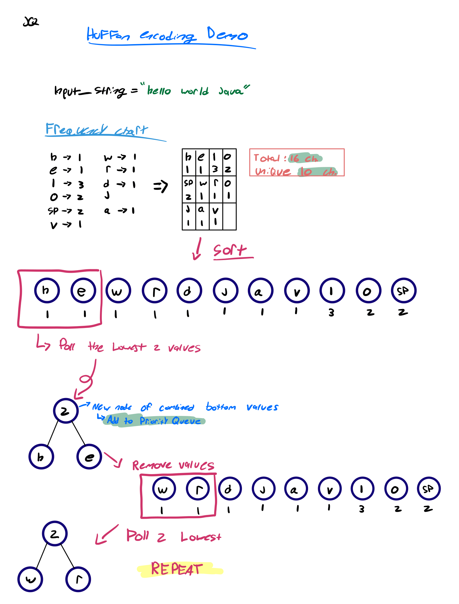
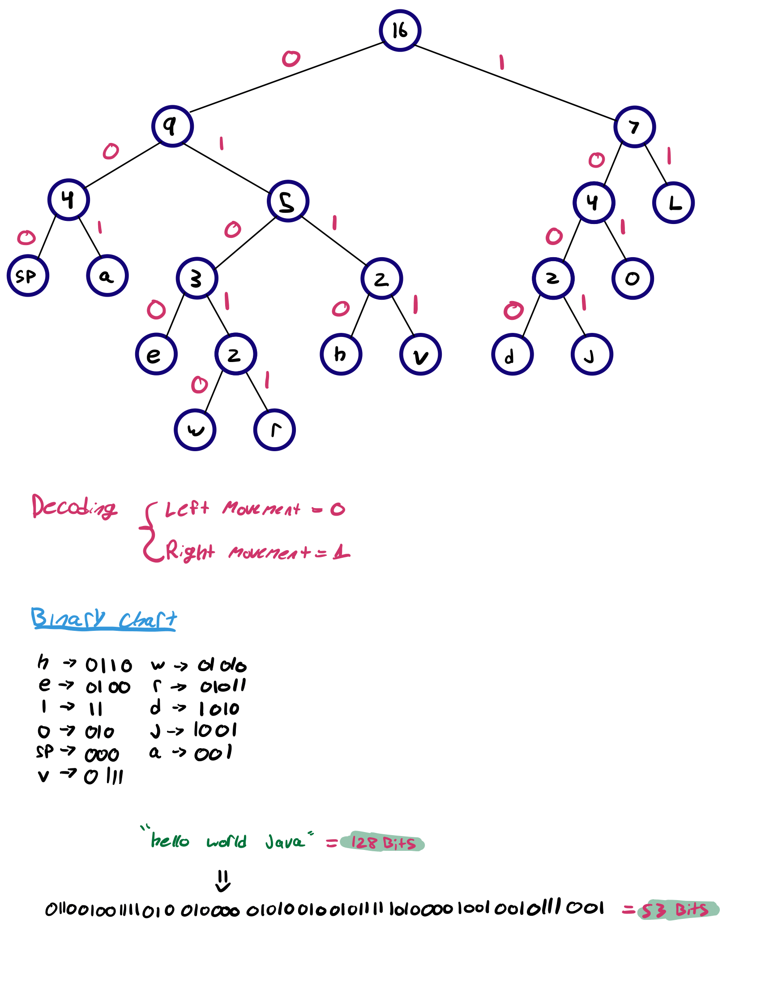

# Huffman-Encoding-Algorithm

## Overview
This Java program takes a string input from the user, encodes it using the Huffman encoding algorithm, and outputs the binary representation of the input string. Additionally, it logs the Huffman codes for each string
to a text file located at ./src/resources/DataLog.txt

 

Huffman coding is a widely used algorithm for lossless data compression. It works by assigning variable-length codes to characters in a string based on their frequencies, with more frequent characters receiving shorter codes and less frequent characters receiving longer codes. Here's a detailed explanation of the Huffman encoding algorithm for a string:

**1. Character Frequency Calculation:**
   - In this step, you perform a frequency analysis of the characters in the input string. Each character's occurrence frequency is counted and recorded in a frequency table. This table holds a mapping of characters to their respective frequencies, providing a statistical profile of the data.

**2. Building the Huffman Tree:**
   - A priority queue, often implemented as a binary heap, is employed to create a Huffman tree. This tree is constructed by iteratively combining the two nodes with the lowest frequencies from the priority queue.
   - These nodes are merged into a new internal node, and their frequencies are summed. This process continues until only one node remains, which becomes the root of the Huffman tree.
   - The use of a priority queue ensures that nodes with lower frequencies are given higher priority in the tree construction, resulting in shorter codes for more frequent characters.

**3. Assigning Huffman Codes:**
   - Traversing the Huffman tree from the root to each leaf node generates Huffman codes. This traversal tracks the path taken and assigns '0' to the left branches and '1' to the right branches.
   - The codes assigned to leaf nodes represent characters and are unique, meaning no code is a prefix of another code. This property enables unambiguous decoding.

**4. Encoding the String:**
   - Encoding the input string involves replacing each character with its corresponding Huffman code. The entire encoded string is formed by concatenating these binary codes together.
   - The encoded data is more compact than the original string, making it suitable for efficient storage and transmission.

**5. Storing Additional Information:**
   - To enable decoding, supplementary information is typically stored along with the encoded string. This information may include the structure of the Huffman tree or the frequency table.
   - Including this metadata ensures that the decoder can reconstruct the original tree, allowing for the precise mapping of binary codes to characters.

**6. Decoding:**
   - To decode the encoded string, you begin at the root of the Huffman tree. For each bit (0 or 1) in the encoded data, you traverse the tree.
   - Following '0' means moving to the left child, while following '1' means moving to the right child. You continue this traversal until reaching a leaf node.
   - At a leaf node, you decode a character and then return to the root to process the next set of bits.
   - This process continues until the entire encoded string has been decoded.

Huffman encoding is highly efficient in reducing data size by assigning shorter codes to more frequent characters, which minimizes the average code length. This compression technique is widely used in data storage, transmission, and archiving applications.

## Features
- Accepts a user-defined input string.
- Utilizes the Huffman encoding algorithm to encode the input string.
- Outputs the binary representation of the encoded string.
- Logs the Huffman codes for each character to txt file.

## Example Visual

 

