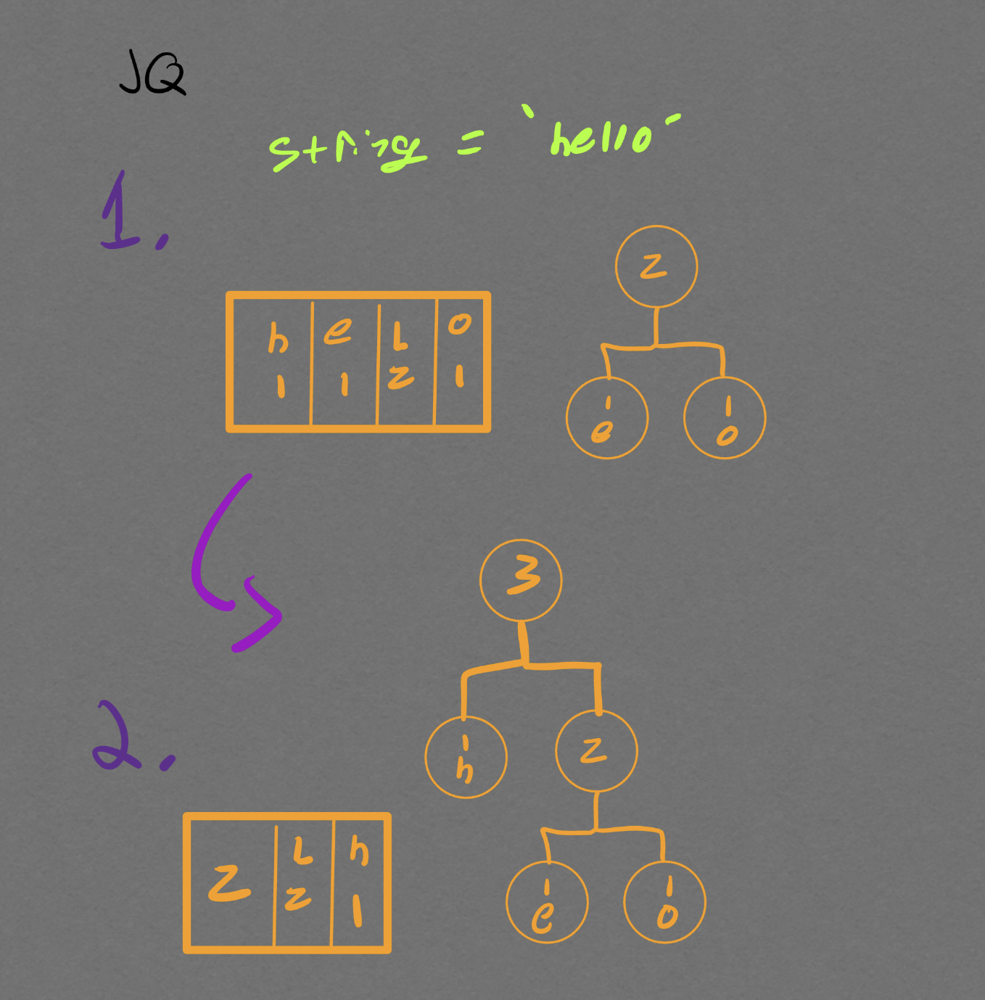
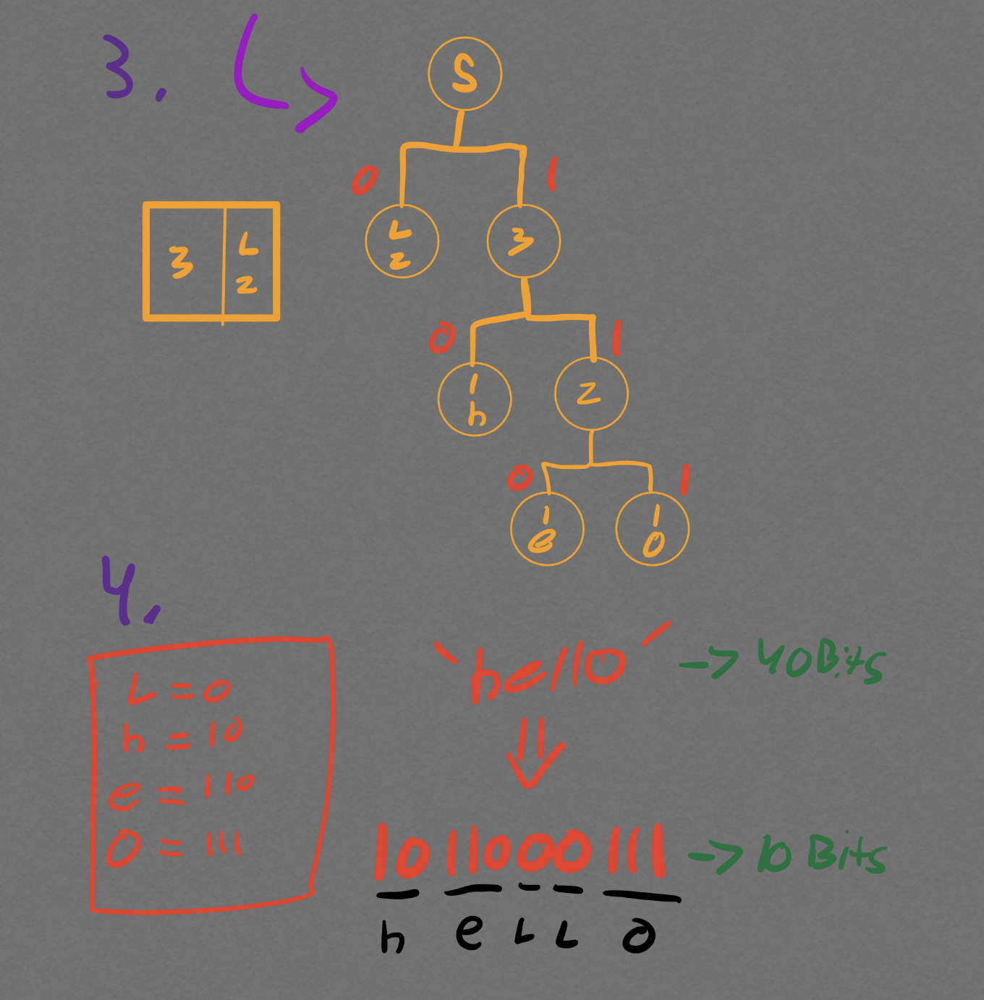

# Huffman-Encoding-Algorithm

## Overview
This Java program takes a string input from the user, encodes it using the Huffman encoding algorithm, and outputs the binary representation of the input string. Additionally, it logs the Huffman codes for each string
to a text file located at ./src/resources/DataLog.txt

## Features
- Accepts a user-defined input string.
- Utilizes the Huffman encoding algorithm to encode the input string.
- Outputs the binary representation of the encoded string.
- Logs the Huffman codes for each character to txt file.

## Example Visual

 

